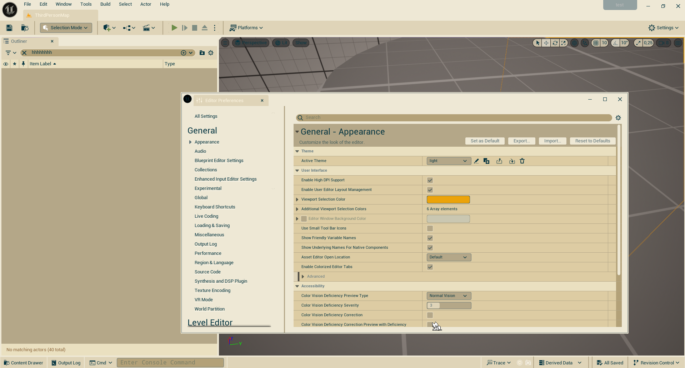

## Usage

1. Go to your `/Engine/Content/Slate` directory
2. Create a `Themes` directory
3. Drop the json file from the `dist` folder in `Themes`.
4. In Unreal Engine, in Preferences > Colors, select your favorite "Active Theme".

